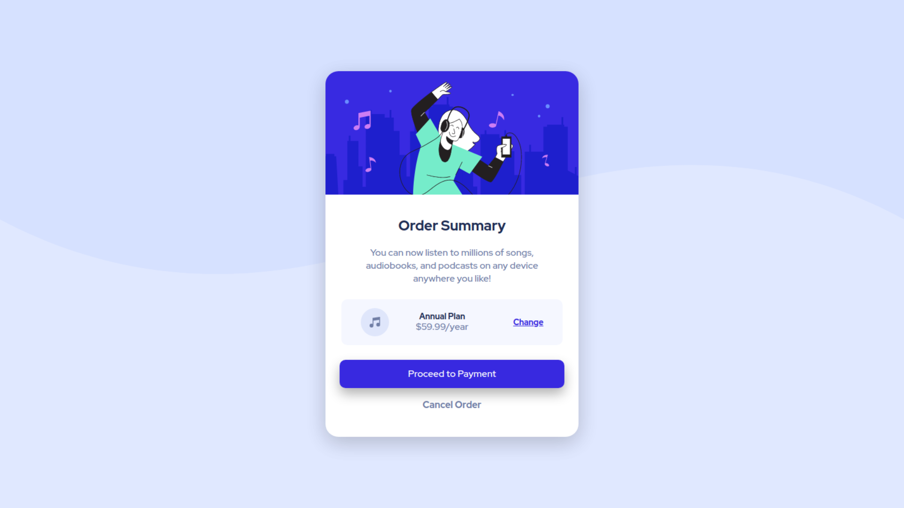

# Frontend Mentor - Order summary card solution

This is a solution to the [Order summary card challenge on Frontend Mentor](https://www.frontendmentor.io/challenges/order-summary-component-QlPmajDUj). Frontend Mentor challenges help you improve your coding skills by building realistic projects. 

## Overview

### The challenge

Users should be able to:

- See hover states for interactive elements

### Screenshot

### Links

- Live Site URL: [migueweb.github.io/order-summary-component](https://migueweb.github.io/order-summary-component/)

## My process

### Built with

- Semantic HTML5 markup
- CSS custom properties
- Normalize CSS
- Media queries
- Flexbox
- Mobile-first workflow

## Author
Miguel Amador
- Github: [@migueweb](https://github.com/migueweb)
- Frontend Mentor: [@migueweb](https://www.frontendmentor.io/profile/migueweb)
